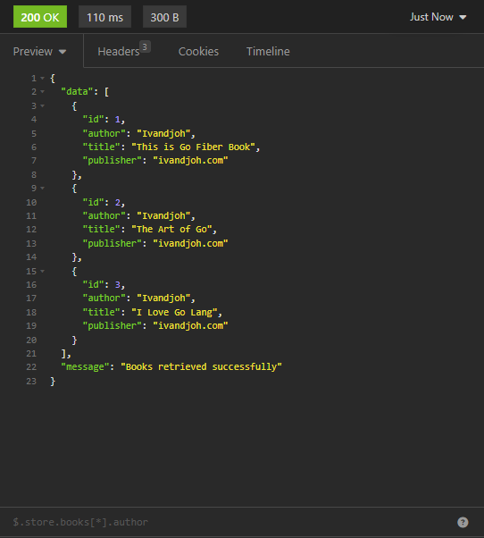

# My GoFiber

## Getting Started  
### Prerequisites
    
      * [Go](https://golang.org/dl/) 1.16 or higher
      * [Docker](https://docs.docker.com/get-docker/) 19.03 or higher
      * [Docker Compose](https://docs.docker.com/compose/install/) 1.25 or higher

### Installation
    
      1. Clone the repo
      2. Install Go packages
      3. Run the app

### Clone the repo
     
        git clone https://github.com/ivandi1980/my-gofiber.git

### Install Go packages
        
- install go fiber
```go get -u github.com/gofiber/fiber/v2```

- install gorm
```go get -u gorm.io/gorm```

- install gorm postgres driver
```go get -u gorm.io/driver/postgres```

- install go dotenv
```go get -u github.com/joho/godotenv```

- install go validator
```go get -u github.com/go-playground/validator/v10```

### Run the app
        
        go run main.go

### Screenshots
